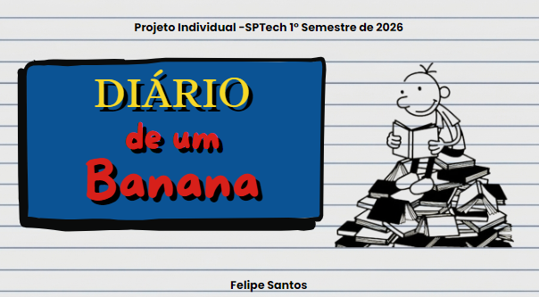
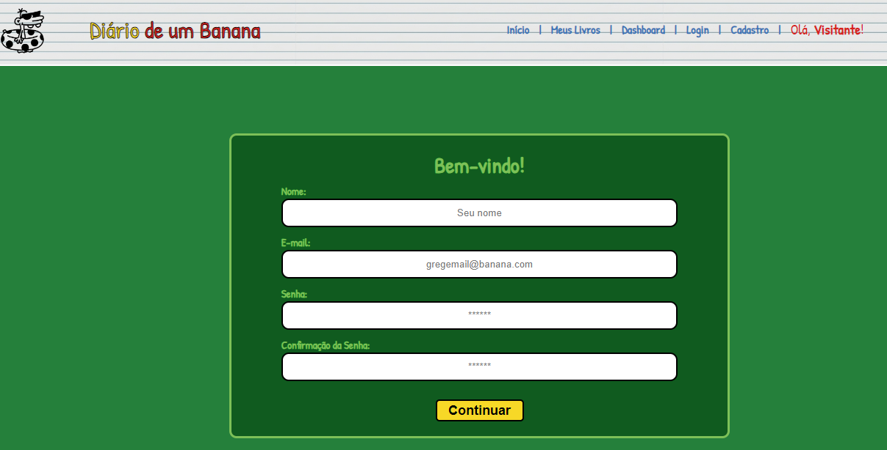
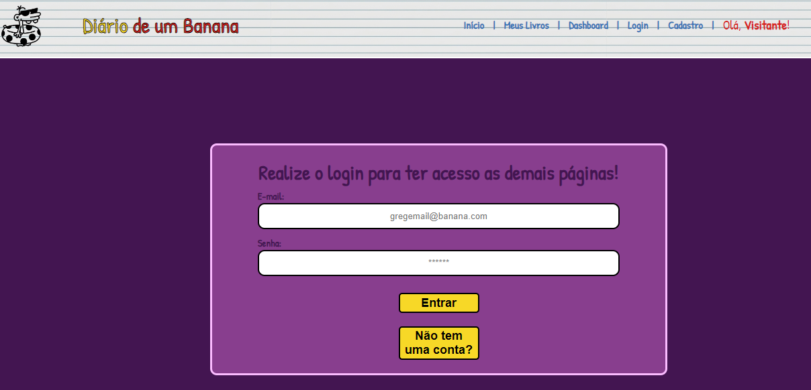
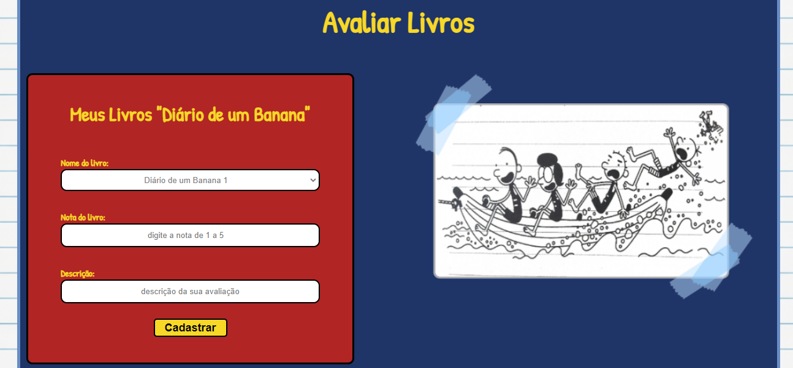
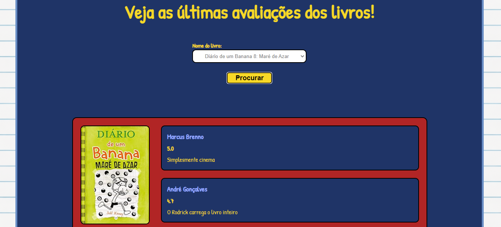
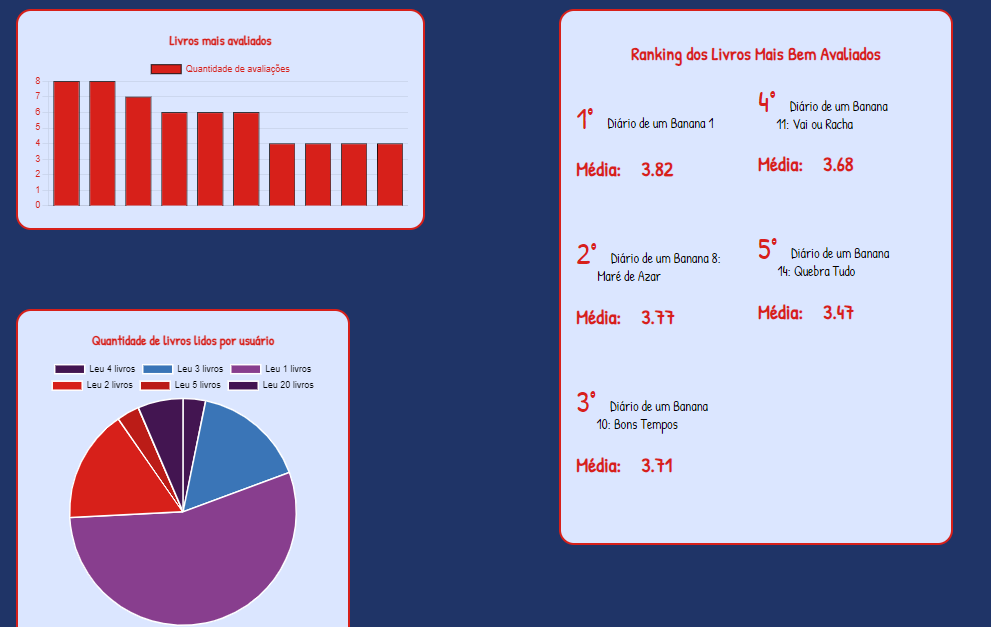

# Diário De Um Banana
<p align="center">
  
   </p>
Projeto Individual desenvolvido na matéria de Pesquisa e Inovação do curso de Ciência da Computação da Faculdade SPTECH - São Paulo Tech School - 1° semestre de 2026.
<hr>

# Funcionalidades
 **Página inicial com apresentação do site**
 <p align="center">
  
   </p>
<hr>

**Cadastro e autenticação de usuários**
<p align="center">
  
   </p>
   <p align="center">
  
   </p>
   <hr>
   
 **Avaliação e consulta de avaliações de livros**
 <p align="center">
  
   </p>
   <p align="center">
  
   </p>
   <hr>
   
**Dashboard para visualização de dados**
<p align="center">
  
   </p>
   <p align="center">
  
   </p>
  <hr>

  # Tecnologias utilizadas
  <p align="left">

  &nbsp;&nbsp;&nbsp;

  &nbsp;&nbsp;&nbsp;

</p>
<hr>

  # Como Executar o Projeto
  
  ## 1. Clone o repositório
```bash
git clone https://github.com/FelipeG-Santos/Projeto-Individual-PI-SPTech-1sem-2026.git
```
<hr>

## 2. Instale as dependências
```bash
 npm i
```
<hr>

## 3. Configure as variáveis de ambiente

Crie um arquivo `.env` e `.env.dev`:

```env
DB_HOST= localhost
DB_USER= root
DB_PASSWORD= sua senha
DB_DATABASE= nome do banco
DB_PORT=3306

APP_PORT=3333
APP_HOST=localhost
```

<hr>

## 4. Configure o ambiente

No arquivo `app.js` habilite o "Produção" caso esteja utilizando o arquivo .env
```js
var ambiente_processo = 'producao';
```

No arquivo `app.js` habilite o "Desenvolvimento" caso esteja utilizando o arquivo .env.dev
```js
var ambiente_processo = 'desenvolvimento';
```
<hr>

## 5. Inicie o projeto

```bash
npm start
